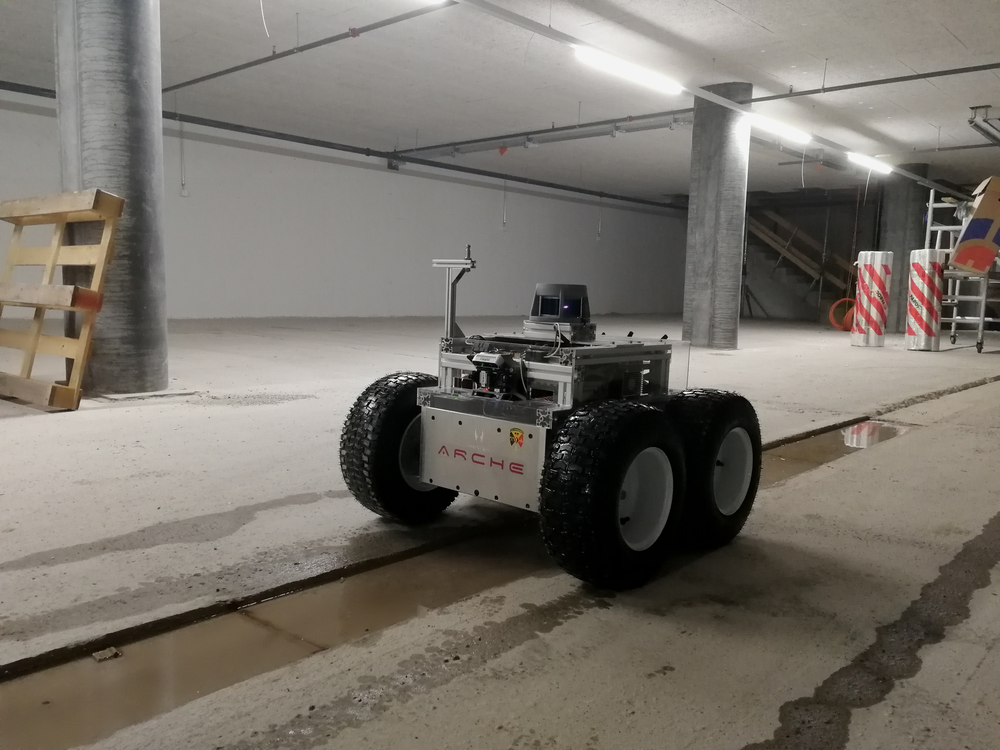

## ETH SuperMegaBot

Build your own autonomous all-terrain robot.

This repository contains all hardware designs, code and part lists and
instructions to build and setup a fully autonomous all-terrain mobile robot.

## Quick-start

* [Bill of Materials](doc/bill_of_materials.md)
* [Robot / personal computer software setup](doc/software_setup.md)
* (Optional) [Maplab setup](doc/maplab_setup.md)
* [Connecting to robot](doc/robot_connection.md)
* Tutorials
    * [Robot Introduction](https://drive.google.com/a/ethz-asl.ch/file/d/1BidZydT57gR4WOJHGMlHoU6hVh9cw4ff/view?usp=sharing)
    * [State Estimation](https://drive.google.com/a/ethz-asl.ch/file/d/17-IkJS-MhA7gOS7I0PP3f6pCcIwZN5bn/view?usp=sharing), [bag-file-1]
    (https://drive.google.com/a/ethz-asl.ch/file/d/1xhHXiSHyT3KEjgKKCgdlKnPD9RHzNPFB/view?usp=sharing), [bag-file-2]
    (https://drive.google.com/a/ethz-asl.ch/file/d/1aNOBNuHR3NbldRSsH2pQcIggj2iH9l-Z/view?usp=sharing), [bag-file-3]
    (https://drive.google.com/a/ethz-asl.ch/file/d/1tjeIzCH7I9EXLB2d6oDAuPN-W4ik41es/view?usp=sharing), [bag-file-4]
    (https://drive.google.com/a/ethz-asl.ch/file/d/137jahQbYWrDPEfWiFAyV0dMtI1wj723c/view?usp=sharing)
    * [3D SLAM](https://drive.google.com/a/ethz-asl.ch/file/d/1oVYVrKWTZQ30-n4mozrIV0fhBB68o2Co/view?usp=sharing), [bag-files]()
    * [Maplab](https://drive.google.com/a/ethz-asl.ch/file/d/1FJ-7agO3bf_9IDv04Qr_bohEKvhlupXB/view?usp=sharing), [bag-files](https://drive.google.com/a/ethz-asl.ch/file/d/1KCGwE4Fm1SdnGaLCRtn5JSS_datZaO-J/view?usp=sharing)
    * [Path Planning](https://drive.google.com/a/ethz-asl.ch/file/d/1CZPfa-In185cvx8SM1mlH_kLO9DpvIIJ/view?usp=sharing)
    * [Trajectory Optimization](https://drive.google.com/a/ethz-asl.ch/file/d/10p4aQ8Ohj0wTo8YdMyVpxJkRIggFNjL5/view?usp=sharing)
* Troubleshooting
    * [Software](doc/troubleshooting_software.md)
    * [Hardware](doc/troubleshooting_hardware.md)
* [Safety](doc/safety.md)

## Organisation
This robot was designed in the ETH Construction Robotics group.
